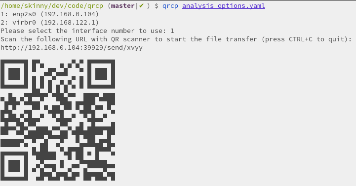

# qrcp

Dart implementation of basic functionality of https://github.com/claudiodangelis/qrcp

Transfer files over Wi-Fi between devices by scanning a QR code without leaving the terminal.

## How does it work?



`qrcp` binds a web server to the address of your Wi-Fi network interface on a random port and creates a handler for it. The default handler serves the content. When used to receive files, `qrcp` serves an upload page and handles the transfer.

The tool prints a QR code that encodes the text:

```
http://{address}:{port}/{random_path}
```

Most QR apps can detect URLs in decoded text and act accordingly (i.e. open the decoded URL with the default browser), so when the QR code is scanned the content will begin downloading by the mobile browser.

# Installation

## Building from source

After cloning repository, navigate to the `qrcp` folder and perform:

```shell
$ dart pub get
```

### Linux

```shell
# Build executable
dart compile exe bin/main.dart -o ./qrcp

# Move the binary
sudo mv qrcp /usr/local/bin
```

# Usage

## Send a file

```shell
qrcp my_file.pdf
```

## Receive files

When receiving files, `qrcp` serves an "upload page" through which you can choose files from your mobile.

_note: receives to the current directory_

```shell
qrcp receive
```
